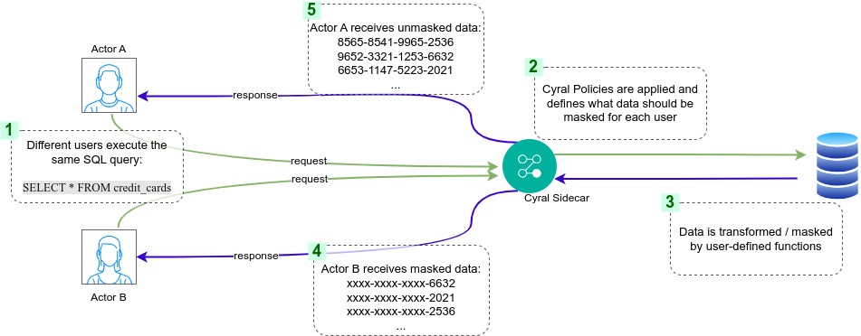

# Quickstart: Custom Masking Functionality

Brief Description
-----------------
Cyral's custom masking feature enables tailored masking behaviors, ensuring precise data protection according to unique requirements. This repository provides a quickstart guide on creating user-defined functions (UDFs), installing them on the target Database System, and integrating them as custom masking rules in Cyral for advanced data masking.

### Overall Requirements
- Database engineers for writing UDFs. 
- Database administrators for installing the UDFs.
  - Permissions, such as `CREATE SCHEMA`, `CREATE DATABASE`, `CREATE FUNCTION`, or `CREATE ANY PROCEDURE`, may be required, depending on the underlying Database system. Specific requirements and instructions are present in the description of each masking example.
- Database administrators for giving end-users the required permissions to execute the UDFs.
- Cyral administrators for creating data policies and configuring data repositories.

  
## Architecture

The diagram above illustrates the components involved and the workflow of creating and deploying custom masking rules using Cyral.

The overall configuration process can be split into four main stages:
 - **Defining Requirements**: A security team or system administrators are responsible for defining the expected masking behavior when certain databases and tables are accessed by different users or groups.
 - **Function(s) development**: Database engineers write one or more user-defined functions that meet the requirements defined by the security team. These functions can be type specific, meant to act on specific database columns, or could be generic, allowing any column to be used as input.
 - **Function(s) deployment**: Database administrators install the custom function(s) in the desirable Database System, making them available to be used in Cyral Policies.
 - **Policy crafting**: Admins with write permissions to the Cyral Management Console write specific [Global or Repo-level Policies](https://cyral.com/docs/policy/policy-structure) that leverages the newly created user-defined functions, which should loaded and enforced by Cyral sidecars on future user queries.

#### Possible end-user workflows

After all required functions are installed and the policies are configured in the Management Console, two possible outcomes are expected for different users when executing the same query:
* the query will returned masked data; or
* the user will get unmasked results.

The diagram above illustrates these possible workflows. Different users execute the same SQL query `SELECT * from credit_cards`. The query goes through the Cyral sidecar, which loads and applies the required data policies. As a result, queries from some users, or group of users, would return masked (or transformed) data, while others would be able to see the original content present in the underlying database.

  
### Installing and Using User-Defined Functions

User-defined functions are usually installed within a database/schema entity inside your Database system. Users can refer to these functions in their query by specifying the function name, with an optional schema/database qualifier. 
* **To get more details on how to install and use UDFs, please refer to**:  
[UDF Installation guide](./install-instructions) and  
[Custom mask documentation](https://cyral.com/docs/using-cyral/masking/custom-masking).

* **To get more details on how to refer to UDFs in your Cyral Policies, please refer to**:  
[Policy construction guide](https://cyral.com/docs/policy/policy-structure).

  
### Example Masking Functions
The examples below are ready to be used and covers masking functions that handle specific use cases. Each guide provide instructions on how to create the required user-defined functions (with their source code), how to install them, how to create the associated Cyral policies and how to validate their behavior.

| Function | Description | Supported Repo Types |
| --------------- | --------------- | --------------- |
| [Consistent Format Preserve](./masking-examples/consistent-format-preserve) | UDF that replaces the field's contents with semi-randomized values. It is noteworthy that this transformation maintains consistency, ensuring that identical field content will consistently translate into the same semi-randomized value. This predictable behavior facilitates reliable data manipulation and analysis within the specified context.| :white_check_mark: PostgreSQL   :white_check_mark: SQL Server   :white_check_mark: Oracle   :white_check_mark: MySQL   :white_check_mark: Snowflake |

  
### Contributing

For adding contributions to this repository, please refer to [CONTRIBUTING.md](./CONTRIBUTING.md) for more details on how to create and raise pull requests.